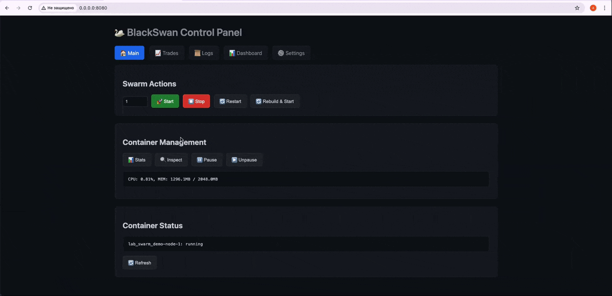

# BlackSwan 🦢

**Autonomous, self‑improving AI swarm with distributed evolution, economic sovereignty, and formally verified core.**

[](https://github.com/Deus-corp/BlackSwan/actions/workflows/python-tests.yml)
[](#license)
[](https://deus-corp.github.io/BlackSwan/)
[](https://sepolia.etherscan.io/tx/0xba457b54f9f674cd2118ba25a8caa342a3cf69c5685523eac814916739825213)

---

## 🚀 Quick Start

### 1. 🌐 Web Control Panel

```bash
pip install fastapi uvicorn docker
python dashboard/app.py
```

Open `http://localhost:8080` to manage the entire swarm:

| Tab | Description |
|-----|-------------|
| 🏠 **Main** | Start/stop nodes, container management (stats, inspect, pause) |
| 📈 **Trades** | Real-time feed of all on-chain swaps with tx links |
| 📜 **Logs** | Filtered swarm logs with auto-refresh and save to disk |
| 📊 **Dashboard** | Embedded Grafana with capital, fitness, diversity charts |
| ⚙️ **Settings** | Edit all compose variables, secrets, and one-click token approval |



### 2. Prometheus + Grafana (optional)

The project includes Prometheus and Grafana for advanced monitoring.  
Start them alongside the swarm:

```bash
docker compose -f mvp/lab_swarm_demo/docker-compose.async.yml up -d prometheus grafana
```

- Prometheus scrapes metrics from http://localhost:8080/metrics
- Grafana (http://localhost:3000, admin/admin) visualizes them. Import the dashboard from grafana/dashboards/blackswan-swarm.json.
Grafana dashboard is also embedded directly in the Web Control Panel (📊 Dashboard tab) in kiosk mode.

### 3. Download LLM Models

The swarm requires at least one local LLM model. Download the recommended ones:

```bash
# SmolLM2-1.7B (fast, low‑resource)
curl -L "https://huggingface.co/bartowski/SmolLM2-1.7B-Instruct-GGUF/resolve/main/SmolLM2-1.7B-Instruct-Q4_K_M.gguf" -o llama_cpp/SmolLM2-1.7B-Instruct-Q4_K_M.gguf

# DeepSeek-R1-Distill-Qwen-1.5B (best reasoning)
curl -L "https://huggingface.co/bartowski/DeepSeek-R1-Distill-Qwen-1.5B-GGUF/resolve/main/DeepSeek-R1-Distill-Qwen-1.5B-Q4_K_M.gguf" -o llama_cpp/DeepSeek-R1-Distill-Qwen-1.5B-Q4_K_M.gguf
```
Set LLM_MODEL=smollm17 or LLM_MODEL=deepseek in docker-compose.async.yml.

---

## 📌 Project Status: **TRL‑4** (laboratory‑validated components)

### Core & Formal Verification
- ✅ TLA+ specs for 8 protocols (Ouroboros, SurvivalObjective, GeneticEngine, CuriosityEngine, AdaptiveMotivation)
- ✅ Industrial CRDT – SQLite‑backed, op‑based with deterministic LWW merge
- ✅ Secure Gossip – HMAC‑signed envelopes, replay protection, peer scoring & backoff
- ✅ Gossip Filter – replay protection and monotonic sequence numbers across all messages
- ✅ Signed genome exchange (Ed25519) for cryptographically verified genome distribution

### Swarm & Communication
- ✅ Docker lab swarm (4–5 nodes) with auto‑recovery (Spore Protocol validated)
- ✅ Spore Protocol – sustained fault‑recovery on 4‑node swarm (SmolLM2‑1.7B, 1h+ run)
- ✅ Logical layer separation (Infrastructure / Intelligence layers) via documented Intelligence Contract v1.0

### Memory & Data Pipeline
- ✅ LocalMemoryAPI – layered memory (episodic, semantic, policy) with snapshot/restore & SQLite persistence
- ✅ Quarantine Buffer – signature, reputation, and confidence checks for incoming memory records
- ✅ Event sourcing – append‑only ledger with trace IDs
- ✅ Gold Filter & dataset export pipeline for future LoRA training

### LLM & Evolution
- ✅ Speciated Genetic Engine with adaptive mutation and fitness cache
- ✅ LLM‑Powered Mutations – local LLMs generate new strategy parameters
- ✅ Multi‑model benchmark – 10 local LLMs compared (135M–1.7B). Report: [benchmark](docs/reports/benchmark_10_models_2026-05-03.md)

### Security & Key Management
- 🔑 Centralized Key Manager – isolated, env‑based secret store; private keys never leaked to logs

### Observability & Operations
- ✅ Health endpoint (`/health`), graceful shutdown, model integrity check
- ✅ Improved Dashboard – 2×2 layout with capital, fitness, diversity/CRDT, and niche pie chart
- 🤖 Telegram Bot – remote monitoring via /status, /nodes, /memory

### Market & Trading
- ✅ **Web3 Testnet Adapter** – fully autonomous Uniswap V3 swaps on Ethereum Sepolia (Alchemy RPC).
- 🔁 **Autonomous Token Manager** – auto-wrap ETH, auto-convert USDC↔WETH based on configurable thresholds.
- 🔗 **Multi‑node Nonce Sync** – SQLite with WAL mode, conflict-free parallel swaps.
- 🏆 **First AI‑driven swap** – [0xba457b54...](https://sepolia.etherscan.io/tx/0xba457b54f9f674cd2118ba25a8caa342a3cf69c5685523eac814916739825213)
- 🌐 **Web Control Panel** – multi‑tab dashboard with trades feed, Grafana, container management.
- 📊 **Prometheus + Grafana** – professional metrics and embedded monitoring dashboards.

- 🌐 **Multi‑Pair Trading** – single node trades BTC/USDT, ETH/USDT, SOL/USDT simultaneously.
- 🧠 **Internet Researcher** – gathers crypto news (sentiment) and on‑chain data for LLM context.
- 📈 **Binance Futures** – long/short trading with configurable leverage, stop‑loss, and dynamic leverage adjustment.
- 🛡️ **Spot/Futures Hedging** – automatic hedging of futures positions with spot orders (configurable ratio).
- 📊 **Order Book Analysis** – real‑time imbalance and delta volume for smarter entries.
- 📡 **TradingView Webhooks** – external trading signals injected directly into LLM context.


---

## ⚡ Quick Start: Real Web3 Trading on Sepolia

1. **Get testnet ETH & WETH** – use Sepolia faucets to fund your wallet.
2. **Create a `.env` file** in `mvp/lab_swarm_demo/`:
   ```ini
   WEB3_PRIVATE_KEY=your_private_key
   MARKET_MODE=web3
   TRADING_SYMBOLS=WETH/USDC
   TEST_WEB3_SWAP_AMOUNT=0.001
   TEST_WEB3_SWAP_SIDE=sell
   WEB3_POOL_FEE=3000
   WEB3_RPC_URL=https://eth-sepolia.g.alchemy.com/v2/YOUR_KEY   # ← Alchemy
   ```
3. Run the swarm:
```bash
cd mvp/lab_swarm_demo
docker-compose -f docker-compose.async.yml up -d --scale node=1
```
4. Watch logs – within minutes, you'll see ✅ Swap successful! in the output.
```text
🦢 The very first AI‑driven on‑chain swap occurred at tx 0xba457b54.... The strategy evolves via genetic algorithms and can repeat profitable trades.
```
---

## 🧬 Key Features

- **Self‑Sovereign Economy** – built‑in market and Kelly‑criterion capital dispatcher.
- **Ouroboros Self‑Improvement** – genetic search for optimal strategies, genome exchange in the swarm, Champion/Challenger.
- **Survival Objective** – each node evaluates detection risk and refuses dangerous actions.
- **Adaptive Intrinsic Motivation** – dynamic balancing of capital, stealth, and curiosity via Meta‑POMDP.
- **Curiosity Engine** – autonomous detection of market anomalies and generation of research hypotheses.
- **Swarm Resilience** – automatic failure detection and Spore Protocol (node rebirth).
- **Formally Verified Core** – critical invariants proven in TLA+.
- **Defense in Depth** – multi‑layer isolation, traffic obfuscation.
- **Control Panel** – interactive CLI menu to start/stop/configure the swarm without Docker commands.

### Current State (11 May 2026)
- Fully autonomous swarm trading WETH/USDC on Uniswap V3 (Sepolia)
- Async Web3 adapter with NonceManager (SQLite/WAL) – no more nonce collisions
- Leader election: only one node sends transactions per block
- Centralized config via Pydantic Settings (swarm_config.py)
- Professional dashboards (FastAPI, Grafana, Prometheus)
- LLM mutations with Pydantic validation and retry
- Multi-node gossip with signing

---

## 🛠️ Swarm Configuration Guide

The default docker‑compose setup uses a local LLM and a simulated market.  
You can customise the swarm through environment variables in `docker-compose.async.yml`.

| Variable | Description | Default |
|----------|-------------|---------|
| `LLM_MODEL` | Which local LLM to use (`smollm2`, `qwen`, `deepseek`, `smollm17`, `llama1b`, `abl_qwen05`, `unc_llama1b` …) | `smollm2` |
| `GOSSIP_SIGNING_ENABLED` | Enable Ed25519 signatures for genome exchange | `false` |
| `FAILURE_PROB` | Probability of node failure per step (Spore test) | `0.0` |
| `TOTAL_NODES` | Number of peers expected in the swarm | `4` |
| `BURN_RATE` | Capital burned per step (cost of living) | `0.1` |
| `MARKET_MODE` | `sim` (simulated), `live` (Binance Testnet), `futures` (Binance Testnet Futures), or `web3` (Arbitrum Sepolia) | `sim` |
| `TRADING_SYMBOLS` | Comma-separated list of trading pairs | `BTC/USDT,ETH/USDT,SOL/USDT` |
| `PRICE_SCALE` | Divider for live prices to fit strategy range | `10000` |
| `FUTURES_LEVERAGE` | Leverage for futures trading | `2` |
| `STOP_LOSS_PERCENT` | Maximum loss before stop-loss (percent) | `2.0` |
| `MAX_LEVERAGE` / `MIN_LEVERAGE` | Dynamic leverage range | `5` / `1` |
| `HEDGE_ENABLED` | Enable spot/futures hedging | `false` |
| `HEDGE_RATIO` | Portion of futures position to hedge with spot | `0.5` |
| `INTERNET_RESEARCHER_ENABLED` | Fetch crypto news and on-chain data | `false` |
| `ORDERBOOK_ANALYSIS_ENABLED` | Analyse order book imbalance | `false` |
| `TRADINGVIEW_WEBHOOK_ENABLED` / `TRADINGVIEW_WEBHOOK_PORT` | Enable TradingView signal webhook | `false` / `8888` |
| `WEB3_RPC_URL` | RPC endpoint for Web3 adapter | `https://sepolia-rollup.arbitrum.io/rpc` |
| `WEB3_PRIVATE_KEY` | Private key for Web3 transactions (store in `.env`) | – |
| `BINANCE_TESTNET_API_KEY` / `BINANCE_TESTNET_API_SECRET` | API credentials for live/futures trading (store in `.env`) | – |
| `ETHERSCAN_API_KEY` | API key for Internet Researcher (store in `.env`) | – |
| `MEMORY_API_ENABLED` | Enable layered persistent memory (`LocalMemoryAPI`) | `false` |
| `LOG_LEVEL` | Python logging level (`INFO`, `DEBUG`) | `INFO` |
| `EVENT_LEDGER_PATH` | Path to append-only event journal | `./data/ledgers/events.jsonl` |
| `EVENT_SQLITE_PATH` | Optional SQLite index for events | `./data/ledgers/events.db` |
| `TELEGRAM_BOT_TOKEN` | Token for Telegram monitoring bot (store in `.env`) | – |

## 🧪 Model Benchmark

```python
python tools/model_benchmark.py   # automatically tests all local LLMs and saves logs to docs/logs/models/
```

## 🤖 Telegram Bot

Commands: `/status`, `/nodes`, `/memory`, `/logs`, `/capital`, `/help`.
The bot answers with real-time swarm metrics and recent logs from running nodes.

```bash
export TELEGRAM_BOT_TOKEN=your_token  # or add to .env
python3 tools/telegram_bot.py
```

## 📚 Documentation & Reports

- 📖 [Documentation site](https://deus-corp.github.io/BlackSwan/)
- 📖 [Architecture decisions](docs/architecture/)
- 📖 [Formal verification](formal/tla/)
- 📖 [Simulation report](docs/TRL4_simulation_baseline.md)
- 📖 [Full TRL‑4 Validation Report](docs/TRL4_VALIDATION_REPORT.md)
- 📖 [Ouroboros Report](docs/TRL4_OUROBOROS_REPORT.md)
- 🗺 [Roadmap](ROADMAP.md)

---

## ❤️ Support the Project

BlackSwan is an independent research project. If you find it valuable,
consider supporting its development:

- **Crypto donations** — see [DONATIONS.md](DONATIONS.md)

All funds go toward infrastructure, compute resources, and further research.
Sponsorship does not confer any rights over the project.

---

## ⚠️ Disclaimer

This software is experimental and has been tested exclusively on simulated and testnet environments (Binance Testnet, local sim). It is not financial advice. Use in real market conditions is at your own risk. Always verify strategies thoroughly and never trade with funds you cannot afford to lose.

---

## 📄 License

Dual‑licensed under MIT or Apache‑2.0, at your option.  
See [LICENSE-MIT](LICENSE-MIT.md) and [LICENSE-APACHE](LICENSE-APACHE.md).

---

*Black Swan © 2026. Technical preprint. Does not constitute a call to action.*