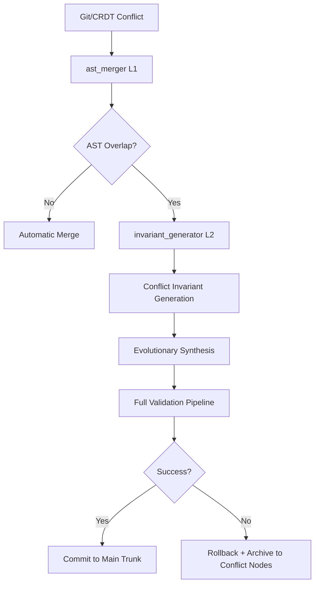

# Appendix O – Tooling for AST Integrity and Test-Driven Evolution (TDE)

## O.1. General Principle
The two-level TLSM (Two-Level Semantic Merge) protocol requires specialized tooling that guarantees the LLM never writes code under conditions of semantic uncertainty. Instead, the LLM is used only to generate formal requirements (Conflict Invariants), while actual conflict resolution occurs through deterministic AST merging and evolutionary synthesis.

This appendix describes the complete set of tools required for TLSM operation, their structure, artifacts, and launch commands.

## O.2. Current Tooling Manifest Artifact

| Field | Value |
| :--- | :--- |
| **CID (IPFS)** | `QmTLSMToolingManifestV2` (updated version) |
| **BLAKE3 hash** | (will be generated) |
| **File name** | `tlsm_tooling_manifest.json` |
| **Version** | 2.0 |

```json
{
  "ast_merger_crdt_bridge": {
    "cid": "QmASTMergerCRDTBridgeV1",
    "type": "library",
    "description": "Rust crate implementing ASTFirstCRDTMerger for integration of Strict AST Merge into Mem0g CRDT operations."
  }
}
```

## O.3. Tooling Structure

### O.3.1. Level 1 – Strict AST Merge
**Tool name:** `ast_merger` (Rust)

**Purpose:** Deterministic merging of AST trees without LLM involvement.

**Key capabilities:**
- Builds the full AST for BASE, OURS, and THEIRS
- Detects overlapping nodes
- Automatically merges non-overlapping changes
- Generates a structured conflict report

**Artifact:** `QmASTMergerV1`

**Launch:**
```bash
ast_merger --base base.rs --ours ours.rs --theirs theirs.rs --output conflict_report.json
```

### O.3.2. Level 2 – Conflict Invariant Generator
**Tool name:** `invariant_generator` (Python + DeepSeek-V4 / Architectus)

**Purpose:** Generation of a minimal set of test-invariants describing the logic of both conflicting branches.

**Strict prompt constraints:**
- LLM receives only the function signature, diff BASE→OURS, and BASE→THEIRS.
- Generating implementation code is forbidden.
- Output only tests (unit + property-based) are required.

**Example prompt (hardcoded in the artifact):**
```text
You are a formal specification generator.
Given the function signature and two diffs, generate ONLY tests that capture the intended behavior of BOTH changes.
Do NOT write any implementation code.
Return only valid pytest + hypothesis code.
```

**Artifact:** `QmInvariantGeneratorV1`

### O.3.3. Evolutionary Synthesizer (Integration with Genetic Engine)
Uses the existing `evolutiond` (section 6.5) in a special "Conflict Resolution" mode.
The fitness function switches to the formula from section 6.5.9.

### O.3.4. Verification Pipeline
After synthesis, the new patch passes through:
- Full deterministic validation pipeline (section 5.3)
- Semantic Integrity Guard (SIG)
- Z3 verification of L3 invariants
- Shadow benchmarking

## O.4. Full TLSM Workflow (MVP)



## O.5. Manual Launch Commands (Debugging)

```bash
# 1. Run Level 1
ast_merger --base main.rs --ours feature-a.rs --theirs feature-b.rs --report conflict.json

# 2. Run invariant generator
invariant_generator --conflict-report conflict.json --output invariants_test.py

# 3. Run evolutionary synthesis
evolutiond --mode conflict-resolution --invariants invariants_test.py --module roi_dispatcher
```

## O.6. Relationship with Other Sections

- **5.14.4** – Conflict-to-Test Transformation (Phase 1)
- **6.5.9** – Conflict Resolution Fitness Mode (Phase 2)
- **7.3.2** – TLSM Protocol (Phase 3)
- **5.3** – Deterministic Validation Pipeline
- **5.13.1** – Error Taxonomy
- **Appendix I** – Formal Verification with Z3

## O.7. Change History

| Version | Date       | Changes                         | CID                      |
| :------ | :--------- | :------------------------------ | :----------------------- |
| V1      | 2026-04-20 | Initial TLSM tooling version    | `QmTLSMToolingManifestV1` |

## O.8. Integration with CRDT Mem0g — ASTFirstCRDTMerger

For seamless application of Strict AST Merge in CRDT merge operations, a specialized crate `ast_merger_crdt_bridge` has been developed. It provides an asynchronous `CRDTMerge` trait used by the Mem0g component when synchronizing knowledge graph nodes.

Crate artifact:
- CID: `QmASTMergerCRDTBridgeV1`
- Name: `ast_merger_crdt_bridge-0.1.0.tar.gz`
- Dependencies: `ast_merger` (Appendix O), `tokio`, `serde_json`.

Rust usage example:

```rust
use ast_merger_crdt_bridge::{ASTFirstCRDTMerger, CRDTMerge};

#[tokio::main]
async fn main() {
    let merger = ASTFirstCRDTMerger::new(
        AstMerger::default(),
        Some(LLMFallback::new("deepseek-v4", SpeciesMask::Architectus))
    );

    let base = KnowledgeNode::load("QmBaseCode").await?;
    let incoming = KnowledgeNode::load("QmIncomingCode").await?;

    match merger.merge(&base, &incoming).await? {
        MergeResult::Merged(cid) => println!("Success: {}", cid),
        MergeResult::MergedWithConflictNode(cid) => println!("Resolved with conflict: {}", cid),
        MergeResult::ConflictNodeCreated(node) => println!("Conflict node created: {}", node.id),
    }
}
```

Python integration with Mem0g:
Via PyO3/maturin, the crate is exported as a Python module `mem0g_crdt`. It is invoked from `sleep_cycle_consolidation` when processing accumulated changes.

Configuration in `global_policy.json`:

```json
{
  "crdt_merge_policy": {
    "strict_ast_first": true,
    "llm_fallback_enabled": true,
    "max_conflict_depth": 5
  }
}
```

## O.9. Continuous Semantic Fuzzing — Automatic Test Generation from AST Changes

### O.9.1. Purpose
TLSM guarantees that code merging does not violate existing invariants, but does not verify that the **new code correctly handles all edge cases specific to the introduced changes**. Continuous Semantic Fuzzing fills this gap: based on the AST diff, **mutation tests** (fuzzing inputs) are automatically generated that check the behavior of modified functions on boundary and unexpected values.

### O.9.2. Integration into TLSM (Level 1.5)

Extended TLSM pipeline:

```
Conflict at AST merge (Level 1)
│
▼
┌─────────────────────────────┐
│ 1.5. Semantic Fuzzing       │
│ - Analysis of changed AST   │
│   nodes                     │
│ - Generation of mutation    │
│   inputs (based on types,   │
│   ranges, structures)       │
│ - Execution on BASE version │
│   (must pass) and on merged │
│   version                   │
└─────────────────────────────┘
│
All tests OK          Discrepancies found
▼                      ▼
Proceed to            Reject merge
Level 2               or rework
(LLM invariants)
```

### O.9.3. Mutation Test Generation Algorithm

**Input:** AST diff between BASE and the merging branches (OURS, THEIRS).

**Steps:**
1. **Extract affected functions and their signatures.**
   - For each modified function, determine the argument types, return type, and used structures.
2. **Generate mutation strategies.**
   - For primitive types (`int`, `float`): boundary values (0, -1, MAX, MIN, NaN, INF).
   - For strings: empty, very long, with null byte, with non-UTF8 sequences.
   - For collections: empty, single-element, huge.
   - For user-defined types: default field values, recursively generated by the same rules.
3. **Generate specific test vectors.**
   - A combinatorial approach (pairwise testing) is used to cover parameter interactions.
   - For functions with side effects (I/O, memory operations), sequences of calls are generated.
4. **Run in an isolated environment (Shadow Sandbox).**
   - Compare execution results on the BASE version and the merge candidate.
   - Any discrepancy (panic, different return values, memory leak) signals rejection of the merge.

### O.9.4. Pseudocode of Fuzz Test Generator

```python
# ast_fuzzer/semantic_fuzzer.py
import ast
import itertools
from hypothesis import strategies as st

class ASTSemanticFuzzer:
    def generate_tests(self, base_ast, merged_ast, functions_diff):
        tests = []
        for func_name, changes in functions_diff.items():
            sig = extract_signature(base_ast, func_name)
            strat = self._build_strategy(sig)
            # Generate boundary and random values
            for _ in range(100):  # Number of tests per function
                args = strat.example()
                tests.append({
                    'function': func_name,
                    'args': args,
                    'expected': evaluate_on_base(base_ast, func_name, args)
                })
        return tests

    def _build_strategy(self, signature):
        strategies = []
        for param_type in signature.parameters:
            if param_type == 'int':
                strategies.append(st.integers())
            elif param_type == 'float':
                strategies.append(st.floats(allow_nan=False, allow_infinity=False))
            elif param_type == 'str':
                strategies.append(st.text())
            elif param_type.startswith('List'):
                inner = self._build_strategy_for(param_type[5:-1])
                strategies.append(st.lists(inner, max_size=100))
            else:
                strategies.append(st.none())  # fallback
        return st.tuples(*strategies)
```

### O.9.5. Integration with Existing Tools

| Tool | Role |
| :--- | :--- |
| `ast_merger` | Provides AST diff and list of affected functions. |
| Hypothesis | Used as a backend for strategy generation and counterexample minimization. |
| Shadow Sandbox | Isolated execution of generated tests. |
| Mem0g L2 | Stores successful tests as `RegressionTest` for future checks. |

### O.9.6. Activation Criteria and Parameters

Activation:
- Always enabled for conflict merges (Level 1.5).
- Optionally can run for ordinary CRDT merges with low `quality_score`.

Parameters in `global_policy.json`:

```json
{
  "tlsm": {
    "semantic_fuzzing": {
      "enabled": true,
      "max_tests_per_function": 100,
      "timeout_sec": 60
    }
  }
}
```

### O.9.7. Success Criteria

| Metric | Target Value |
| :--- | :--- |
| Hidden defects detected, missed by regressions | ≥ 1 per month on active codebase |
| False positives (discrepancy due to non-determinism) | ≤ 5% |
| Fuzzing time per merge | ≤ 60 seconds |
