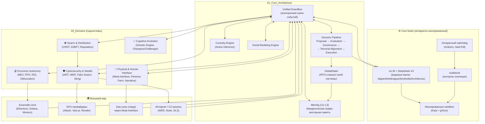

# 🧩 Архитектура Black Swan (обзор)

На этой странице представлена высокоуровневая архитектура системы **Black Swan** – автономного, саморазвивающегося ИИ-роя. Диаграмма и пояснения ниже помогут быстро понять, как связаны между собой основные компоненты.

> **Для детального изучения используйте:**  
> – [00_Manifesto](Design_Principles.md) – принципы  
> – [01_Core_Architecture](./01_Core_Architecture/) – центральные модули  
> – [03_Domains](./03_Domains/) – подсистемы  
> – [ADR](./ADR/) – история архитектурных решений

---

## 🗺️ Общая диаграмма компонентов и связей

---

## 🧠 Ключевые архитектурные решения

### 1. Species‑as‑Experts (единая MoE-модель)

Все виды системы – Architectus (стратег, 60% экспертов), Sentinella (защитник, 40%), Arbtiragius (трейдер, 30%) и Vagrant (разведчик, 20%) – работают на базе одной модели DeepSeek‑V4.
Виды различаются только подмножеством активируемых экспертов, что радикально экономит VRAM и упрощает синхронизацию знаний.

Подробнее: ADR 001, Global State & Decision Pipeline

### 2. GlobalState и Decision Pipeline

GlobalState – атомарный снимок всей системы (балансы, узлы, знания), хранящийся в IPFS.
Decision Pipeline – единственный путь для любых действий:
Proposal → Evaluation (ROI, Survival Score) → Governance (BFT) → Terminal Alignment → Execution → Feedback.

Для высокочастотных операций (трейдинг, ответы на угрозы) существует Fast Path – исполнение с пост-аудитом.

Подробнее: Global State & Decision Pipeline

### 3. Unified EventBus и Артефактная модель

Все компоненты общаются через единую событийную шину EventBus. Каждое значимое действие фиксируется как подписанный артефакт (IPFS CID), формируя направленный ациклический граф (DAG). Это даёт полную воспроизводимость и аудит.

Подробнее: Event Bus & Artifact Model

### 4. Иерархическая память Mem0g

Знания хранятся на четырёх уровнях:

· L0 Meta – оптимизация самой памяти.
· L1 Hot – сырые логи итераций (TTL 24-48ч).
· L2 Semantic – стратегии, сигнатуры ошибок (постоянно).
· L3 Core – неизменяемые инварианты и Core DNA (только через консенсус).

Репликация между узлами роя – CRDT (Conflict-free Replicated Data Type) с предиктивным роутером (PCR) для снижения конфликтов.

Подробнее: Memory Hierarchy Mem0g

### 5. Defense in Depth (эшелонированная защита)

Безопасность обеспечивается на всех уровнях:

· Аппаратный – watchdog с физическим отключением питания.
· Гипервизорный – Kata Containers + VFIO (GPU passthrough).
· Контейнерный – gVisor (быстрые тесты), Firecracker (секреты).
· Кодовый – seccomp, AppArmor, egress allowlist.
· Сетевой – WER 2.0 (луковые релеи), стеганография (GLS 2.0), имитация человеческого трафика (HLTM).

Подробнее: Isolation & Sandbox, Stealth & C2

### 6. Формальная верификация критических инвариантов

Все жизненно важные свойства (устойчивость цикла Ouroboros, сохранение L3.0-аксиом при эволюции, восстановление после катастроф) формально доказаны с помощью TLA+ и SMT-решателей (Z3, CVC4, Yices). Для доказательств, сгенерированных LLM, применяется Concolic Filtering для отсева тривиальных тавтологий.

Подробнее: Appendix Y – Verification Report, Appendix I – Z3 Verification

### 7. Spore Protocol (выживание после глобального коллапса)

Система способна восстановиться даже после полного уничтожения всех активных узлов. Multi‑Species Spore – трехуровневое холодное хранение Core DNA (Zombie Seed, Minimal Viable Spore, Core DNA Spore) с использованием схемы Шамира, Time‑Lock Puzzle и PUF-привязки.

Подробнее: Spore Protocol & Recovery

---

## 📂 Где что лежит (быстрый переход)

Интерес Документы
Как устроена память и знания? Mem0g
Как принимаются решения? Decision Pipeline
Как работает ИИ-трейдинг? MEV & PPO Executors
Как маскируется трафик? Stealth & C2
Как защищены узлы? Isolation & Sandbox
Какое оборудование нужно? Hardware Isolation, Appendix J (BOM)
Как верифицируются инварианты? Appendix Y, Appendix D (TLA+)
Какие ключевые решения были приняты? ADR

---

Black Swan – архитектурный обзор. Версия 2.0 (DeepSwan), апрель 2026.
