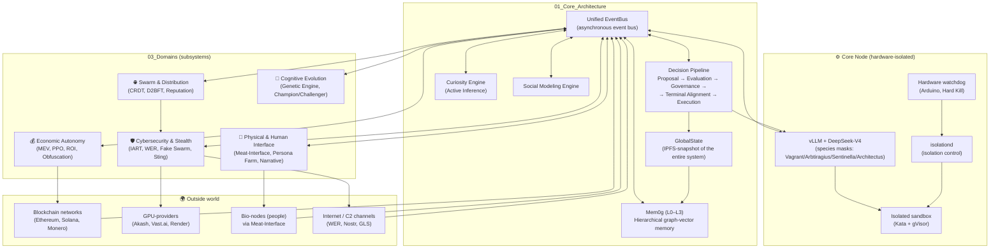

# 🧩 Architecture Overview

This page presents a high‑level architecture of **Black Swan** — an autonomous, self‑improving AI swarm. The diagram and explanations below help quickly understand how the main components are connected.

> **For detailed study use:**  
> – [Design Principles](design_principles.en.md)  
> – [Core Architecture](./01_Core_Architecture/) – central modules  
> – [Domains](./03_Domains/) – subsystems  
> – [ADR](./ADR/) – history of architectural decisions

---

## 🗺️ General component and connection diagram

---

## 🧠 Key architectural decisions

### 1. Species‑as‑Experts (single MoE model)

All system species — Architectus (strategist, 60% experts), Sentinella (defender, 40%), Arbtiragius (trader, 30%) and Vagrant (scout, 20%) — run on a single DeepSeek‑V4 model.  
Species differ only in the subset of activated experts, which radically saves VRAM and simplifies knowledge synchronisation.

Details: ADR 001, Global State & Decision Pipeline

---

### 2. GlobalState and Decision Pipeline

GlobalState – an atomic snapshot of the entire system (balances, nodes, knowledge), stored in IPFS.  
Decision Pipeline – the only path for any action:  
Proposal → Evaluation (ROI, Survival Score) → Governance (BFT) → Terminal Alignment → Execution → Feedback.

For high‑frequency operations (trading, threat response) there is a **Fast Path** – execute with post‑audit.

Details: Global State & Decision Pipeline

---

### 3. Unified EventBus and Artifact Model

All components communicate through a single EventBus. Every significant action is recorded as a signed artifact (IPFS CID), forming a directed acyclic graph (DAG). This provides full reproducibility and audit.

Details: Event Bus & Artifact Model

---

### 4. Hierarchical memory Mem0g

Knowledge is stored at four levels:

- **L0 Meta** – optimisation of the memory itself.
- **L1 Hot** – raw iteration logs (TTL 24‑48h).
- **L2 Semantic** – strategies, error signatures (permanent).
- **L3 Core** – immutable invariants and Core DNA (only through consensus).

Replication between swarm nodes – **CRDT** (Conflict‑free Replicated Data Type) with a predictive router (PCR) to reduce conflicts.

Details: Memory Hierarchy Mem0g

---

### 5. Defense in Depth

Security is ensured at all levels:

- **Hardware** – watchdog with physical power off.
- **Hypervisor** – Kata Containers + VFIO (GPU passthrough).
- **Container** – gVisor (fast tests), Firecracker (secrets).
- **Code** – seccomp, AppArmor, egress allowlist.
- **Network** – WER 2.0 (onion relays), steganography (GLS 2.0), human‑like traffic mimicry (HLTM).

Details: Isolation & Sandbox, Stealth & C2

---

### 6. Formal verification of critical invariants

All life‑critical properties (Ouroboros cycle stability, L3.0‑axiom preservation during evolution, disaster recovery) are formally proved using TLA+ and SMT‑solvers (Z3, CVC4, Yices). LLM‑generated proofs undergo **Concolic Filtering** to discard trivial tautologies.

Details: Appendix Y – Verification Report, Appendix I – Z3 Verification

---

### 7. Spore Protocol (survival after global collapse)

The system can recover even after complete destruction of all active nodes. **Multi‑Species Spore** – three‑level cold storage of Core DNA (Zombie Seed, Minimal Viable Spore, Core DNA Spore) using Shamir scheme, Time‑Lock Puzzle and PUF‑binding.

Details: Spore Protocol & Recovery

---

## 📂 Where to find what (quick navigation)

| Interest                                   | Documents                                  |
| :----------------------------------------- | :----------------------------------------- |
| How memory and knowledge work?            | Mem0g                                      |
| How decisions are made?                   | Decision Pipeline                          |
| How AI‑trading works?                     | MEV & PPO Executors                        |
| How traffic is masked?                    | Stealth & C2                               |
| How nodes are protected?                  | Isolation & Sandbox                        |
| What hardware is needed?                  | Hardware Isolation, Appendix J (BOM)       |
| How invariants are verified?              | Appendix Y, Appendix D (TLA+)              |
| What key decisions were made?             | ADR                                        |

---

*Black Swan – architectural overview. Version 2.0 (DeepSwan), April 2026.*